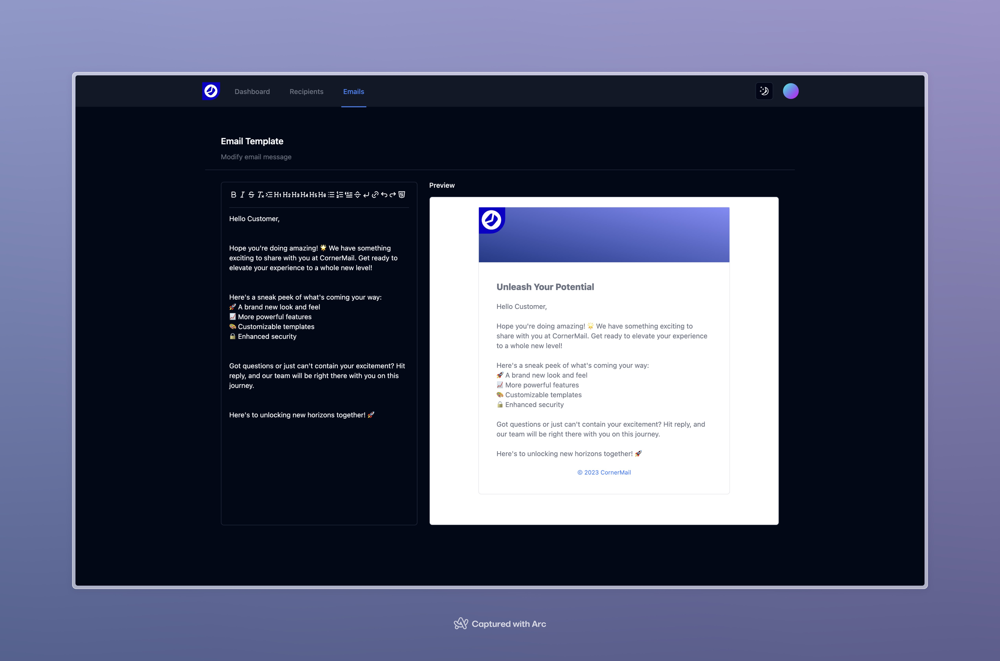

# CornerMail

Welcome to the revamped ~~Dottax~~ CornerMail web application! CornerMail is a powerful tool designed to simplify and streamline email blasting, now built on the latest Next.js 14 framework with TypeScript. It introduces several new features and technologies to enhance your email campaign experience.

## Features

- **Email Blasting**: Send emails to multiple recipients at once.
- **Email Templates**: Create and save email templates for future use.
- **Recipient Management**: Manage your email recipients with ease. Upload recipients from a CSV/XLSX file.
- **Email Tracking**: Monitor the status of your sent emails.
- **Email Analytics**: View detailed analytics for your email campaigns.
- **Email Automation**: Automate your email campaigns with ease.
- ~~**Email Scheduling**: Schedule emails to be sent at a later time.~~ (Coming soon)

## Screenshot

## Stack

- **Framework**: [Next.js 14](https://nextjs.org/14)

- **Language**: [TypeScript](https://www.typescriptlang.org)

- **Authentication**: [NextAuth.js](https://next-auth.js.org)

- **Database**: [Vercel Postgres](https://vercel.com/postgres)

- **Deployment**: [Vercel](https://vercel.com/docs/concepts/next.js/overview)

- **State Management**: [Zustand](https://zustand-demo.pmnd.rs/)

- **Tables**: [TanStack Table](https://tanstack.com/table/latest)

- **Styling**: [Tailwind CSS](https://tailwindcss.com)

- **Components**: [Tremor](https://www.tremor.so), [Shadcn/ui](https://ui.shadcn.com/)

- **Linting/Formatting**: [Biome](https://biomejs.dev/)

- **Testing**: [Vitest](https://vitest.dev/)
- **Monitoring**: [Vercel](https://vercel.com/docs/monitoring)

## License

CornerMail is open-source and licensed under the [MIT License](LICENSE).

## End notes

I hope you find the upgraded CornerMail a valuable tool for simplifying your email campaigns and delivering an exceptional user experience.

Happy Email Blasting!
